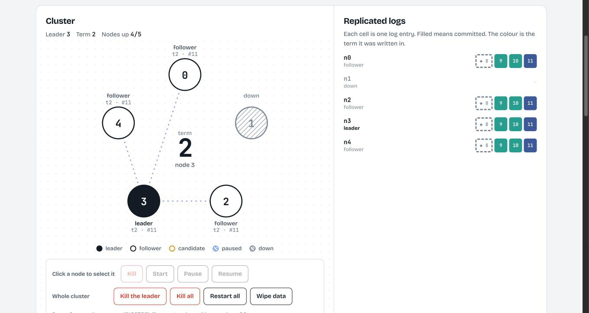

<p align="right"><a href="README.zh-CN.md"><picture><source media="(prefers-color-scheme: dark)" srcset="docs/images/lang-dark.svg"></picture></a></p>

<div align="center">
  <h2>KVstorageBaseRaft-cpp</h2>
  <p>
    
    
    
    
    
    
    <a href="https://github.com/44sunsetsf/KVstorageBaseRaft-cpp/actions/workflows/ci.yml"></a>
  </p>
  <p>A <strong>distributed key-value store built on Raft</strong>, written in C++ from the ground up: consensus, a Protobuf RPC framework, a coroutine library and a skip-list storage engine.</p>
</div>

## What it does

Start several nodes and they form one cluster that behaves like a single key-value database. Clients `Put`, `Append` and `Get` against it; every write goes through the Raft log and is applied in the same order on every node, so the cluster keeps serving correct data **as long as a majority of nodes are alive**. When the leader goes down, the remaining nodes elect a new one and the client finds it on its own. Killed nodes recover their state from disk.

## Try it

**Live:** https://raft.yunfanteo.world — five real nodes you can kill, pause and restart, with a one-click failover test.



The page draws what the nodes report over their own `Status` RPC: role, term, commit index and the tail of each log. The cells are log entries, filled once committed and coloured by the term they were written in. "Run failover test" writes keys, kills the leader, writes more, kills every node, restarts them and checks that no key was lost; a typical run on the live demo sees a new leader in about 400 ms.

Run it yourself (needs only Docker):

```bash
docker compose -f demo/docker-compose.yml up --build   # then open http://localhost:8000
python3 demo/tests/e2e.py http://localhost:8000        # the same failover flow, as a test
```

## Architecture

```
  Clerk (client) ──Put / Append / Get (RPC)──►  KvServer ×N
  · caches the last known leader                  │  dedup by (ClientId, RequestId)
  · retries on ErrWrongLeader / timeout           │  waits on a per-index channel until the op is applied
                                                  ▼
                                          Raft node ◄──RequestVote / AppendEntries / InstallSnapshot──► peers
                                          │  election · log replication · commit · snapshots
                                          │  heartbeat & election tickers run on the fiber IOManager
                                          ▼
                       applyChan ──► state machine: SkipList<string, string>
                                          │
                                          ▼
                       Persister: raftstatePersist{i}.txt · snapshotPersist{i}.txt (atomic, fsynced)
```

| Layer | Directory | Role |
|---|---|---|
| Client | `src/raftClerk` | `Clerk` with `Put / Append / Get`; generates a random client id and an increasing request id, rotates through nodes until it hits the leader |
| Service | `src/raftCore/kvServer.*` | Exposes the KV and `Status` RPCs, turns requests into Raft log entries, applies committed entries to the skip list, makes and installs snapshots |
| Consensus | `src/raftCore/raft.*` | Leader election, log replication, commit index advancement, log compaction and snapshot transfer |
| RPC | `src/rpc`, `src/raftRpcPro` | Home-grown RPC on top of Protobuf services: muduo server side, plain TCP client channel |
| Coroutines | `src/fiber` | `ucontext` fibers, an epoll-based `IOManager`, timers and syscall hooks |
| Storage | `src/skipList` | Templated skip list used as the state machine, with dump/load for snapshots |

## Core design

**Raft consensus**
- Randomised election timeout (300–500 ms) and a 25 ms heartbeat; candidates vote with the up-to-date check from the paper (last log term, then last log index).
- `AppendEntries` carries an `UpdateNextIndex` hint so a lagging follower can tell the leader how far back to jump instead of stepping one entry at a time.
- The leader only advances `commitIndex` for entries from its current term once a majority has matched them.
- A new command wakes a replicator thread that sends `AppendEntries` immediately; commands that arrive while a round is in flight go out together in the next one. When `commitIndex` moves, the applier is woken at once.

**Persistence**
- `currentTerm`, `votedFor`, the log and the snapshot boundary are serialised with Boost.Serialization and written *before* the node replies to anyone.
- Every write goes to a temporary file, is `fsync`ed, and is renamed over the old file (then the directory is synced), so a crash leaves either the old state or the new one. Snapshots are written before the log is truncated.
- A node that is killed with `kill -9` and restarted reads its state back and catches up from the leader.

**Log compaction and snapshots**
- When the Raft state grows past `maxraftstate`, `KvServer` dumps the skip list plus the dedup table into a snapshot and Raft drops the log up to that index.
- Followers that fall behind the leader's snapshot receive it through `InstallSnapshot`.

**Client semantics**
- Every request carries `(ClientId, RequestId)`; `KvServer` remembers the last applied id per client, so a retried write is never applied twice.
- `Get` goes through the log too, so reads see every write committed before them.
- A request waits on a channel keyed by its log index, with a 500 ms consensus timeout; on timeout or leadership loss the client retries elsewhere.

**RPC framework**
- Wire format: `uint32(length) + varint32(header length) + RpcHeader{service, method, args_size} + args` for requests and `uint32(length) + message` for responses, all encoded with Protobuf. The server cuts frames out of the TCP byte stream, so partial and coalesced requests are handled.
- `RpcProvider` registers any `google::protobuf::Service` and dispatches on service and method name; it runs on muduo with 4 I/O threads.
- `MprpcChannel` implements `RpcChannel`, so callers use the generated Protobuf stubs as if they were local calls. It allows one call in flight per connection, ignores `SIGPIPE` (`MSG_NOSIGNAL`), has a receive timeout and reconnects when the peer has gone away.

**Fiber library**
- Stackful coroutines on `ucontext`, an N:M scheduler and an epoll `IOManager` with a timer heap.
- Hooks on `sleep`, `read`, `write`, `connect` and friends turn blocking calls into yields; Raft's tickers run as fibers.

## Performance

The project I started from had no working persistence and waited for the next heartbeat before replicating every write. Same machine, same 3-node setup, median of 3 runs of `scripts/bench.sh`:

| | Original | Same settings | Tuned |
|---|---|---|---|
| Write latency, 1 client (avg) | 24.0 ms | 5.0 ms | 2.0 ms |
| Writes/s, 1 client | 41 | 198 | 501 |
| Writes/s, 8 clients | 165 | 196 | 536 |

Measured with `kvbench` (a C++ client, sequential `Put`s) against 3 nodes with `fsync` on, in Docker on an Apple-silicon Mac, default Debug build. "Same settings" is the new code with the original's hard-coded `maxraftstate` of 500 bytes, which snapshots on nearly every write; "tuned" uses the new default of 1 MB. The original does not persist anything, so its numbers do not include any disk sync.

What changed, and why it showed up in those numbers:

- **Replicate on write, apply on commit.** The leader used to wait up to 25 ms for the next heartbeat before sending a new entry, then the applier polled every 10 ms. Both are now event-driven.
- **A safer RPC layer.** Length-prefixed frames, full reads, one call per connection at a time, timeouts. Before, a closed peer killed the process with `SIGPIPE`, and two requests in one TCP segment left a client waiting forever.
- **Bugs found while testing:** state files were truncated on every start, so a restart lost everything; snapshot restore turned every value into its key; `Append` overwrote the value; every client process shared one id, so writes from a second client were dropped as duplicates; and the leader spun at 100% CPU because a tick of 25 ms was written as 25 µs.

## Quick start

Requirements: Linux, GCC with C++20, CMake ≥ 3.22, [muduo](https://github.com/chenshuo/muduo), Boost (serialization), Protobuf. The code relies on epoll, `ucontext` and libstdc++ internals, so it does not build on macOS; use a Linux machine, VM or container (`demo/Dockerfile` has a working build recipe).

```bash
# Ubuntu 22.04
sudo apt install -y build-essential cmake libboost-dev libboost-serialization-dev \
                    protobuf-compiler libprotobuf-dev
# muduo has no apt package: build and install it from source

mkdir cmake-build-debug && cd cmake-build-debug
cmake .. && make -j"$(nproc)"          # add -DCMAKE_BUILD_TYPE=Release for an optimised build
```

Binaries end up in `bin/`. Start a three-node cluster, then talk to it from another terminal:

```bash
cd bin
./raftCoreRun -n 3 -f test.conf        # forks 3 nodes on random ports and writes their addresses to test.conf
./kvcli test.conf put city Gothenburg  # also: append <key> <value>, get <key>
./kvcli test.conf get city
./callerMain                           # 500 Put/Get rounds
```

`raftCoreRun` takes `-m <bytes>` for the snapshot threshold. State is kept in `raftstatePersist{i}.txt` and `snapshotPersist{i}.txt` in the working directory and is picked up again on the next start; delete the files to start from scratch. Set `RAFT_DEBUG=0` to silence the debug output.

Nodes can also be run one by one, which is how the playground does it. They do not wait for each other, so any of them can be killed and started again at any time:

```bash
C=127.0.0.1:7001,127.0.0.1:7002,127.0.0.1:7003
./raftNode -i 0 -c $C -d /tmp/n0 &     # -i node id, -c the whole cluster, -d data directory
./raftNode -i 1 -c $C -d /tmp/n1 &
./raftNode -i 2 -c $C -d /tmp/n2 &
```

Tools and scripts:

| | What it does |
|---|---|
| `scripts/demo_failover.sh` | Kills the leader, then every node, restarts, and checks that the data survived |
| `scripts/bench.sh` | Write benchmark (`kvbench`) against a fresh 3-node cluster |
| `demo/tests/e2e.py` | The same failover flow against a running playground; CI runs it on every push |
| `provider` / `consumer` | The RPC framework on its own (`example/rpcExample`, see [rpc_example.md](example/rpcExample/rpc_example.md)) |
| `test_scheduler`, `test_iomanager`, `test_hook`, `test_server` | The fiber library (`example/fiberExample`) |

## Repository layout

```text
KVstorageBaseRaft-cpp
├── src/
│   ├── raftCore/      # Raft node, KvServer, Persister
│   ├── raftClerk/     # client
│   ├── raftRpcPro/    # .proto files for Raft and KV RPCs
│   ├── rpc/           # RPC framework (provider, channel, controller)
│   ├── fiber/         # coroutine library (scheduler, IOManager, hooks, timers)
│   ├── skipList/      # skip-list state machine
│   └── common/        # config constants, utilities
├── example/           # raftCoreExample (raftCoreRun, raftNode, kvcli, kvbench) · rpcExample · fiberExample
├── demo/              # the playground: Python gateway, web UI, Dockerfile, deploy scripts, e2e test
├── scripts/           # failover demo and benchmark
├── test/              # small experiments (defer, formatting)
└── docs/              # notes and images
```

Run `make format` to apply `.clang-format` to the sources.

## Roadmap

Directions I plan to work on:

- **Correctness**: partition and message-loss tests modelled on the MIT 6.824 suite, and a linearizability checker over recorded histories.
- **Elections**: pre-vote, so a node that cannot reach a majority stops inflating the term (the playground shows it: kill three nodes and watch the term climb).
- **Reads**: ReadIndex or leader leases so `Get` no longer has to go through the log.
- **Replication**: request ids in the RPC layer so several `AppendEntries` can be in flight per follower, and replace the per-RPC `std::thread` with the fiber scheduler.
- **Cluster features**: membership changes and sharding.
